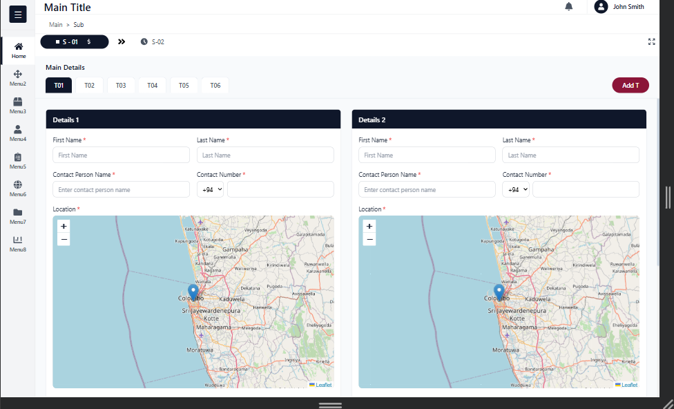
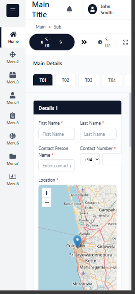

# Organia UI Task - React Implementation

## Project Overview

This is a React-based implementation of the UI design provided by Organia Innovations Labs for their internship assessment. The application features a responsive dashboard interface with form management, interactive map integration, and pixel-perfect UI implementation.

## Technology Stack

### Core Technologies
- **React 18.2.0** - Frontend framework
- **TypeScript 4.9.5** - Type-safe development
- **Tailwind CSS 3.4.1** - Utility-first CSS framework
- **React Leaflet 4.2.1** - Interactive map component
- **Leaflet 1.9.4** - Map library

### Build Tools
- **React Scripts 5.0.1** - Build configuration
- **PostCSS 8.4.33** - CSS processing
- **Autoprefixer 10.4.17** - CSS vendor prefixing

## Features Implemented

### ✅ Layout Components
- [x] Left sidebar navigation with Home and Menu2-Menu7 items
- [x] Collapsible sidebar functionality
- [x] Top navigation bar with user profile and notifications
- [x] Breadcrumb navigation (Main > Sub)
- [x] Tab navigation (T01-T06) with active state
- [x] Multi-section form layout

### ✅ Form & Content Sections

#### Main Details Section
- [x] Two side-by-side detail cards (Details 1 & Details 2)
- [x] Name input fields (First Name, Last Name)
- [x] Contact fields (Contact Person, Contact Number with country code)
- [x] Interactive map component
- [x] Auto-populated latitude and longitude
- [x] Province dropdown selector
- [x] District and City inputs
- [x] Street/Lane and Address Note fields
- [x] Required field indicators (*)

#### Map Integration
- [x] Interactive Leaflet map
- [x] Click-to-pin location selection
- [x] Real-time latitude/longitude display
- [x] Automatic coordinate population
- [x] Map marker visualization

#### Sub Details Section
- [x] Name and Type fields
- [x] Total Value and Description
- [x] Quantity and Number inputs
- [x] Weight (KG) field
- [x] Dimensions: Height, Length, Width (in meters)
- [x] Proper field grouping and layout

### ✅ Functionality
- [x] React state management for all forms
- [x] Real-time form input handling
- [x] Map click event handling
- [x] Coordinate auto-population
- [x] Tab switching functionality
- [x] Required field validation (UI indicators)

### ✅ Responsiveness
- [x] Desktop layout (1920px+)
- [x] Tablet layout (768px+)
- [x] Collapsible sidebar for smaller screens
- [x] Responsive grid layouts

## Project Structure

```
organia-ui-task/
├── public/
│   └── index.html              # HTML template
├── src/
│   ├── assets/                 # Static assets (currently empty)
│   ├── components/             # Reusable React components
│   │   ├── Sidebar.tsx         # Left sidebar navigation
│   │   ├── TopNavigation.tsx   # Header with user profile
│   │   ├── TabNavigation.tsx   # Tab controls
│   │   ├── Detailscard.tsx     # Main details form card
│   │   ├── MapComponent.tsx    # Interactive map
│   │   └── SubDetails.tsx      # Product details form
│   ├── layout/                # Layout components
│   │   └── MainLayout.tsx      # Main application layout
│   ├── App.tsx                 # Root component
│   ├── Main.tsx               # Application entry point
│   └── index.css               # Global styles + Tailwind
├── tailwind.config.js          # Tailwind configuration
├── tsconfig.json               # TypeScript configuration
├── postcss.config.js           # PostCSS configuration
├── package.json                # Dependencies and scripts
└── README.md                   # This file
```

## Setup and Installation

### Prerequisites
- Node.js 16.x or higher
- npm 8.x or higher

### Installation Steps

1. **Clone the repository**
   ```bash
   https://github.com/Sithruby/organia-ui-task-Sithruby.git
   cd organia-ui-task
   ```

2. **Install dependencies**
   ```bash
   npm install
   ```

3. **Start the development server**
   ```bash
   npm start
   ```

4. **Open your browser**
   Navigate to `http://localhost:3000`

### Build for Production

```bash
npm run build
```

The optimized production build will be in the `build/` directory.

## Usage Guide

### Interactive Map
1. Click anywhere on the map to select a location
2. The latitude and longitude fields will automatically populate
3. The marker will update to show the selected position

### Form Interactions
- All input fields support real-time data entry
- Required fields are marked with a red asterisk (*)
- Country code selector for phone numbers
- Province dropdown with predefined options
- Type selector in Sub Details section

### Navigation
- Use sidebar icons to navigate between sections
- Click tab buttons (T01-T06) to switch between tabs
- Active states show current selection

## Screenshots

### Desktop View


### Tablet View
![Tablet]](tablet.png)

### Mobile View



## Color Scheme

The application uses a professional color palette:

- **Navy Blue** - `#1a2332` (Primary background)
- **Dark Navy** - `#0f1419` (Sidebar, headers)
- **Burgundy** - `#7d1f3e` (Action buttons)
- **Gray Scale** - Various shades for borders and backgrounds
- **Blue Accent** - `#3b82f6` (Focus states)

## Known Limitations

### Current Version
- ✅ All core features implemented
- ✅ Map integration fully functional
- ✅ Responsive design complete
- ✅ Form validation (UI indicators)


## Development Notes

### Code Quality
- TypeScript strict mode enabled
- Consistent component structure
- Reusable component patterns
- Clean code principles followed
- Proper prop typing


## Git Commit History

```

#1, project initialized with React and Tailwind CSS
#2 sidebar and top navigation implemented
#3 Top navigation Updated and Tabnaviagtion implemented
#3, main details form completed with map integration
#Subdetail section added
#5, final UI polish and README documentation
```

## Contributing

This is an internship assessment project.

## License

This project is created as part of an internship assessment for Organia Innovations Labs.

## Acknowledgments

- Design provided by Organia Innovations Labs
- Map tiles by OpenStreetMap contributors
- Icons from Tailwind CSS

---

**Built with ❤️ for Organia Innovations Labs Internship Assessment**

Last Updated: February 2026